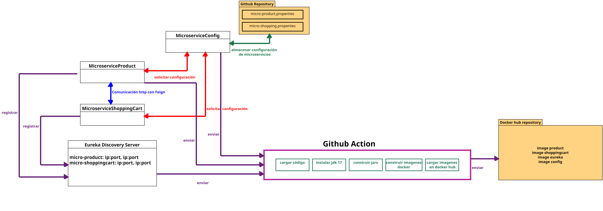

# Proyecto Final [Lista de laboratorios](../README.md)

La empresa netec requiere una implementación en microservicios para controlar el sistema de articulos y el carrito de compras.
Para netec es importante el buen diseño de las  aplicaciones, porque se piensa agregar más en un futuro. Y también la carga de trabajo es variable. 

## Características de microservicio articulo
El microservicio articulos debe permitir:

- El CRUD de la entidad
- La entidad articulo debería tener los siguientes atributos:
    - **id:long**
    - **name:String**
    - **description:String**
    - **price:double**

## Características del microservicio Carrito

Por cuestiones de seguridad debe protegerse este microservicio usando **Openid Connect**

- La entidad Carrito debe de tener los siguientes elementos:
    - **articulos:List**
- No es necesario guardarlo en una base de datos el Carrito de compras
- El microservicio debe conectarse al microservicio articulo cuando inserte un articulo. 
- Debe tener una función que retorne la suma total del costo de los productos. 

## Características de implementación

- La configuración de los microservicios debe estar externalizada usando **Spring Cloud Config**

- Usar el servicio de descubrimiento eureka, para el registro de los microservicios. 

- Debes de generar las imágenes de tus microservicios usando **Github Actions**

- Guardar todos tus entregables en una carpeta **entregables** dentro de tu repositorio. 

## Diagrama Propuesto

## Entregable

- Se debe enviar un correo a **edgardo.velasco@netec.com** con el url de tu repositorio.
> **IMPORTANTE**: **para la revisión tu repositorio este debe estar público, si no esta publico no se califica proyecto**

- Dentro de tu repositorio debes de crear una carpeta llamada **entregables** con 4 carpetas 1 llamada **producto**, otra llamada **carrito**,  otra llamada **config** y la última **eureka**

    - En la carpeta **producto** añadir las siguientes capturas:
        - 4 capturas de pantalla 1 por cada método del **CRUD** 
    
    - En la carpeta **carrito** añadir las siguientes capturas:
        - 1 captura de la función **ver todos los productos**
        - 1 captura de la función **insertar producto**
        - 1 captura de la función **total productos**
    
    - En la carpeta **config** añadir las siguientes capturas:
        - 1 captura obteniendo la configuración de **micro-product**
        - 1 captura obteniendo la configuración de **micro-shoppingcart**
    
    - En la carpeta **eureka** añadir las siguientes capturas:
        - 1 captura del **dashboard eureka** donde se muestren ambos microservicios registrados

> **IMPORTANTE**: Si falta alguna de las capturas o proyectos afecta en tu calificación final. 