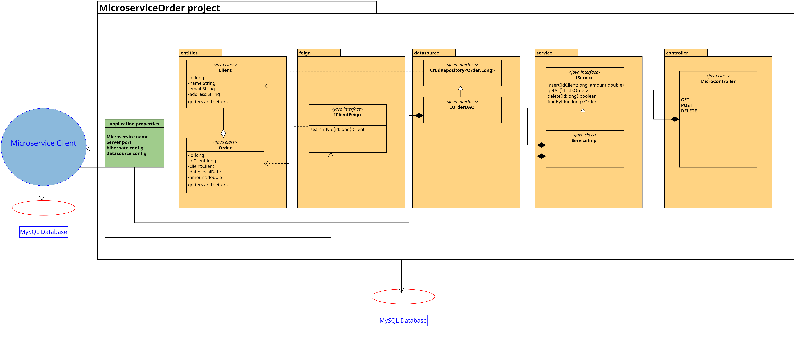

# Implementando comunicación HTTP para los microservicios

En una empresa de ventas solicitan 2 módulos que se van a comunicar entre ellos **Cliente** y **Orden** para llevar el registro de las ordenes y almacenarlas en una base de datos

## Objetivos
- Implementar Feign para comunicar microservicios
- Diseñar interface de comunicación Feign
- Probar la comunicación de microservicios usando postman o insomnia

## Diagrama

## Instrucciones
1. Para este ejercicio es necesario usar el microservicio cliente que se implementó en el módulo anterior. 
> **Nota** en caso de no tener el **MicroserviceClient** puedes descargarlo de la carpeta **[capitulo4](../Capitulo4/)**

2. Iniciar el microservicio cliente e ignorarlo por el momento

3. Crear un nuevo proyecto **File**->**New**->**Spring Starter Project** 

4. Configuración inicial proyecto
- **Name**: MicroserviceOrder
- **Type**: Maven
- **Packaging**: jar
- **Java versión**: 17
- **Language**: java
- **Group**: com.bancolombia
- **Version**: 1.0.0
- **Description**: my order microservice with feign
- **Package**: com.bancolombia.app

5. Dependencies
- **Spring Boot DevTools**
- **Spring Data JPA**
- **MySQL Driver**
- **OpenFeign**
- **Spring Web**

> **IMPORTANTE**: *Es fundamental esperar a que el proyecto este completamente construido* 

6. Creamos los paquetes que contendrán nuestro código **MicroserviceOrder** -> **src/main/java** -> **Click Derecho en com.bancolombia.app** -> **New**-> **Package** (6 veces el mismo proceso)

- **entities**
- **datasource**
- **feign**
- **datasource**
- **service**
- **controller**

## Resultado Esperado